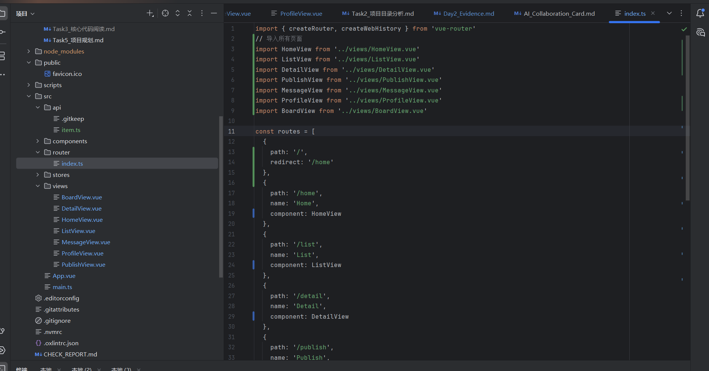
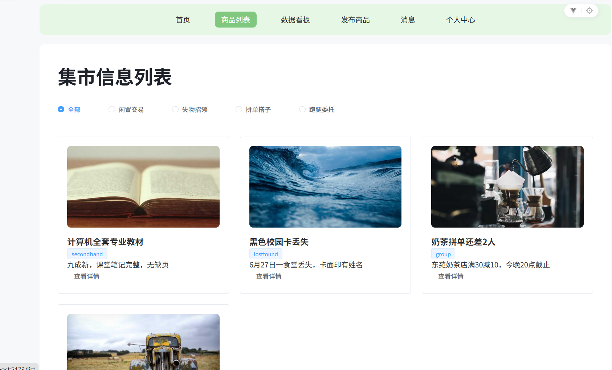
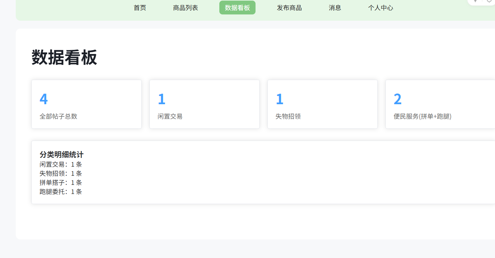
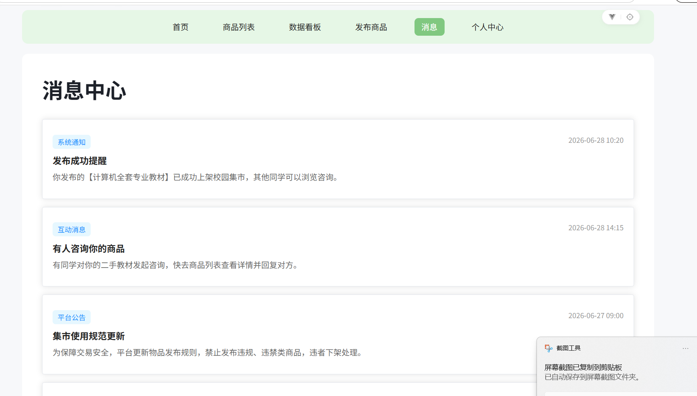
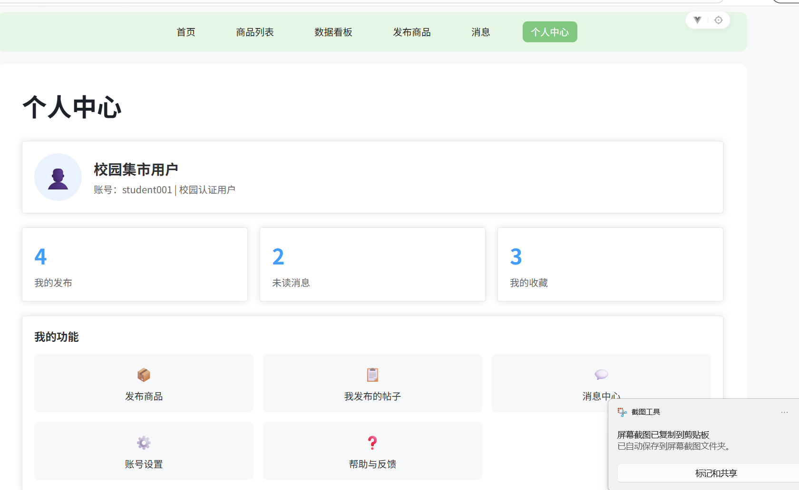
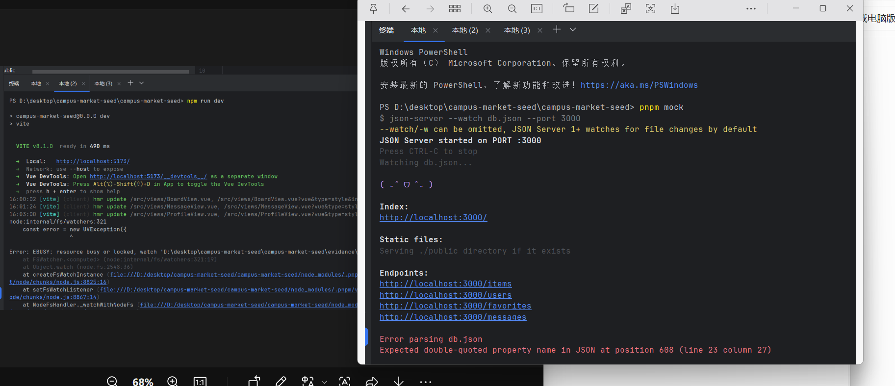

Day2 校园轻集市前端实训开发记录
一、今日实训目标对照
理解 PC 端 Web App 的页面骨架设计思路 ✅
根据页面清单创建对应 Vue 页面文件 ✅
使用 Vue Router 配置基础路由 ✅
实现首页、二手交易、失物招领、拼单搭子、跑腿委托等页面跳转 ✅
设计并实现项目公共布局组件（顶部导航栏）✅
区分页面组件、通用公共组件的作用 ✅
使用 AI Coding 生成页面骨架，手动审查调整代码 ✅
记录开发过程，形成本份 Day2 证据卡 ✅
二、今日完成开发内容
1. 项目页面骨架搭建
   在src/views目录创建全部业务页面组件：
   HomeView.vue 首页
   ListView.vue 商品列表（集市信息列表，含分类筛选）
   BoardView.vue 数据看板（统计各类帖子数量）
   PublishView.vue 发布商品
   MessageView.vue 消息中心
   ProfileView.vue 个人中心
2. 公共布局封装
   封装全局顶部导航通用组件，所有页面共用一套导航栏，实现路由自动高亮，消除每个页面重复写导航的冗余代码，符合组件复用思想。
3. Vue Router 路由配置
   配置 6 条页面路由，绑定路径、页面组件、路由名称；
   通过<router-link>实现导航点击跳转；
   利用router-link-active实现当前页面导航高亮；
   个人中心菜单增加编程式跳转$router.push，完善页面交互。
4. 各页面业务内容填充
   商品列表页：请求 mock 后端/items接口，渲染闲置交易、失物招领、拼单搭子、跑腿委托四类帖子卡片，支持分类筛选，卡片可跳转详情；
   数据看板：拉取全部商品数据，前端遍历统计四类帖子数量，用数字卡片展示总发布量、各类业务数据，完成数据可视化基础展示；
   消息中心：模拟系统通知、互动咨询、平台公告、便民推送四类消息列表，区分消息类型、展示发布时间；
   个人中心：展示用户基础信息、个人发布 / 消息 / 收藏统计数字，提供功能导航菜单，点击可跳转对应业务页面；
   发布商品页：完成表单基础骨架，可录入商品类型、描述、图片等信息。
5. 代码分层规范
   页面组件：存放于views文件夹，对应独立业务页面；
   通用组件：公共导航、卡片样式等全局复用模块，存放于components文件夹；
   清晰区分两类组件的职责，降低代码维护成本。
6. AI 辅助开发流程
   使用 AI 生成页面基础模板、路由配置、统计逻辑代码；
   人工审查生成代码，修正样式、适配项目统一卡片圆角风格；
   调整接口请求逻辑，适配项目现有 mock 接口；
   优化交互跳转逻辑，修复 AI 生成代码中路由、样式 bug。
   三、开发过程遇到的问题与解决方案
   问题 1：pnpm 命令无法识别，终端报错
   解决：替换npm run dev、npm run mock执行启动命令，避开 pnpm 环境变量异常问题。
   问题 2：localhost:5173拒绝连接，页面空白
   解决：前端服务终端被关闭，新开终端执行npm run dev重启 Vite 服务，保持前端、mock 双终端同时运行。
   问题 3：启动 mock 后端提示 3000 端口占用
   解决：不重复执行 mock 命令，保留原有运行 mock 的终端，仅新开终端运行前端，避免端口冲突。
   问题 4：终端执行 npm install echarts 命令卡死、无下载日志
   解决：放弃图表依赖安装，重构纯数字无图表版数据看板，无需新增依赖即可完成统计展示，不耽误实训进度。
   问题 5：页面导航切换无高亮
   解决：使用 vue 自带router-link-active类名，匹配当前路由实现导航高亮效果。
   四、实训技术收获
   掌握 PC 端 Vue 项目分层开发思路：公共布局包裹多业务页面，复用通用组件减少重复编码；
   熟练 Vue Router 基础配置、声明式 / 编程式两种页面跳转方式；
   学会前端接口数据聚合统计，不修改后端即可实现基础数据看板；
   能合理利用 AI 工具快速生成页面骨架，并自主排查、修复代码缺陷；
   熟悉前端开发常见报错（端口占用、命令失效、服务断开）的排查处理方法。
   五、项目截图证据（填写时插入截图）
   项目目录结构截图（展示 views 全部页面、公共导航组件）
   ### 1. 项目目录结构截图（展示views全部页面、公共导航组件）

### 2. 路由配置文件代码截图

### 3. 商品列表页面运行效果图

### 4. 数据看板页面运行效果图

### 5. 消息中心页面运行效果图

### 6. 个人中心页面运行效果图

### 7. 双终端同时运行mock + 前端服务截图

路由配置文件代码截图
   商品列表页面运行效果图
   数据看板页面运行效果图
   消息中心页面运行效果图
   个人中心页面运行效果图
   双终端同时运行 mock + 前端服务截图